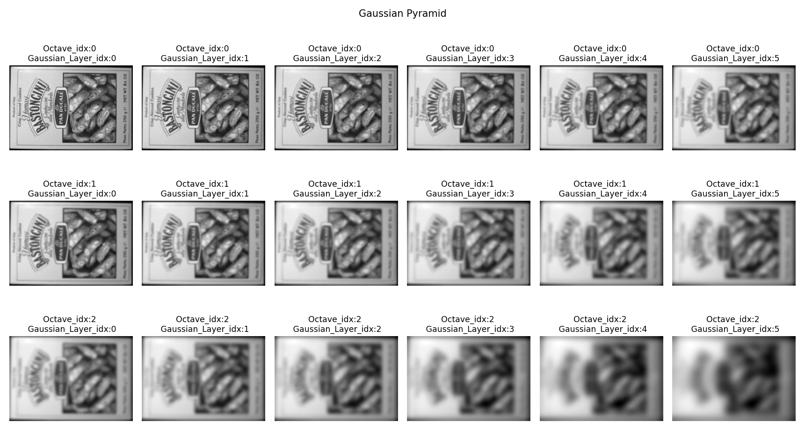
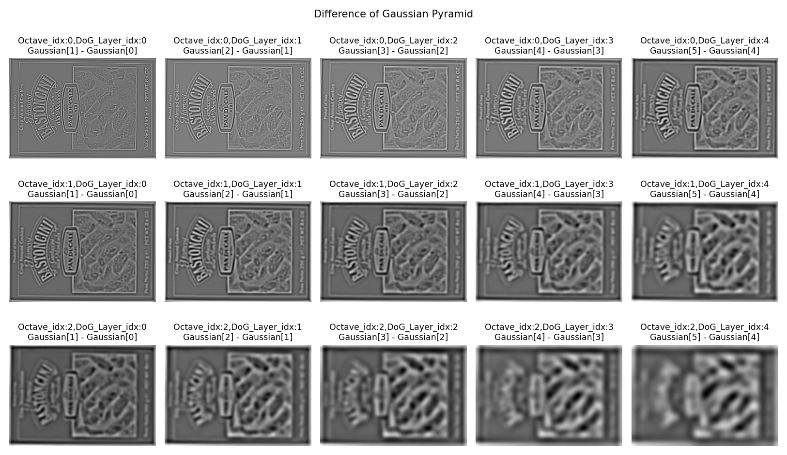
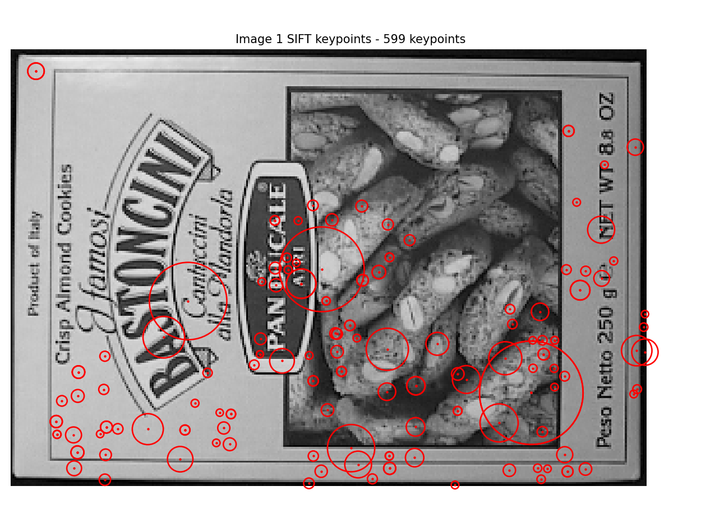
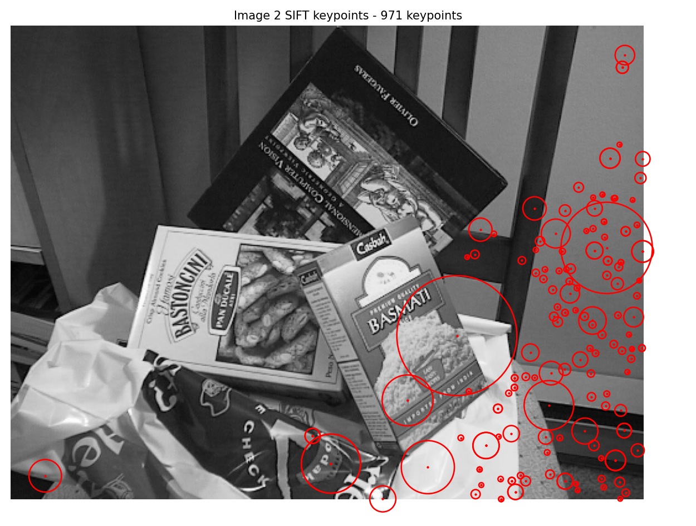
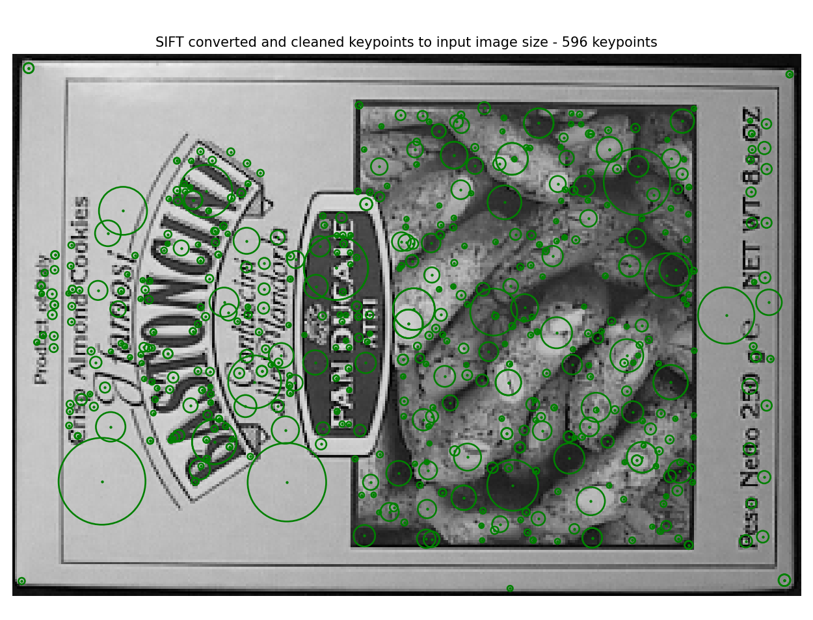
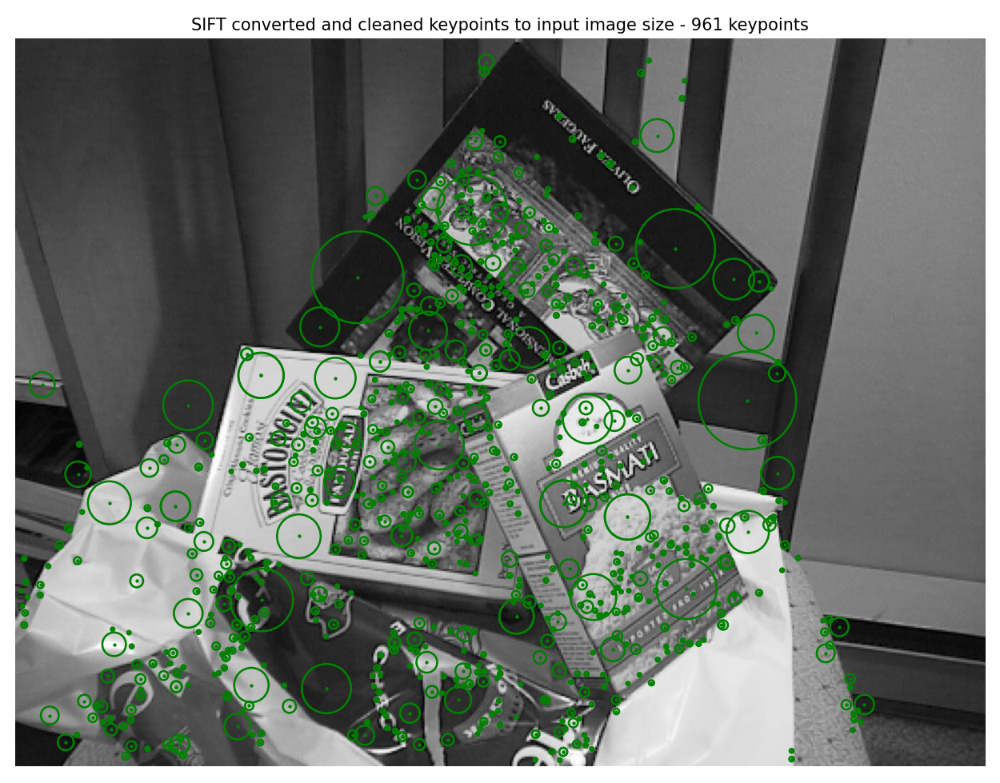
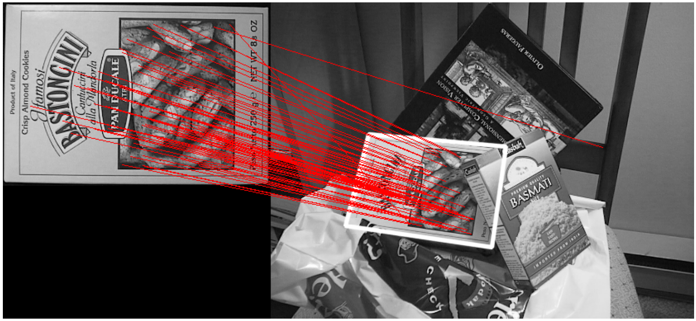

# PySIFT
Implementation of SIFT based on Python

Gaussian Pyrami:

Difference of Gaussian Pyramid:

Visualize keypoints:
| data\Box\box.png                                             | data\Box\box_in_scene.png                                    |
| ------------------------------------------------------------ | ------------------------------------------------------------ |
|  |  |

Visualize converted and cleaned keypoints:
| data\Box\box.png                                             | data\Box\box_in_scene.png                                    |
| ------------------------------------------------------------ | ------------------------------------------------------------ |
|  |  |

match result:

